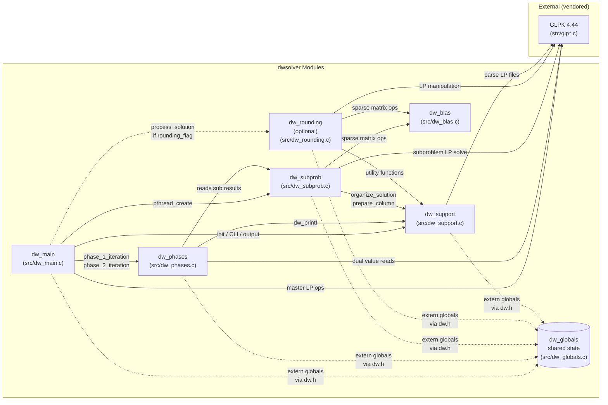

# Component Diagram

This diagram shows the seven dwsolver source modules, their call and dependency relationships,
and the vendored GLPK library as a single external block.
Use it to determine which file to modify for a given change, and to understand the scope of
impact when modifying any given module.

> **Solid arrows** = direct function calls or structural dependency.
> **Dashed arrows** = optional or indirect dependency (conditional call path or extern-variable access).
> **`dw_globals` cylinder** = definitions-only translation unit; it defines no functions, only global variables declared `extern` in `dw.h`. All other modules access it implicitly via the header.

---

## Module responsibilities

| Module | Primary responsibility |
|--------|----------------------|
| **`dw_main`** | Program entry point. Orchestrates the full run: CLI parsing, thread spawning, Phase 1 and Phase 2 iteration loops, final master LP solve, optional rounding, and output writing. |
| **`dw_phases`** | Implements `phase_1_iteration()` and `phase_2_iteration()`. Each function collects N subproblem results from the service queue, adds master columns, solves the master LP, pushes updated dual values, and re-wakes subproblems. |
| **`dw_subprob`** | Worker thread entry point (`subproblem_thread()`). Loads and solves the subproblem LP; calls `signal_availability()` to enqueue its result and wait for the next iteration signal. |
| **`dw_support`** | Utility layer: CLI argument parsing (`process_cmdline`), D-matrix setup (`prepare_D`), globals/signals initialisation (`init_globals`, `init_signals`), solution output (`get_solution`), logging (`dw_printf`), and pthread primitive setup. |
| **`dw_globals`** | Definitions-only translation unit. Defines all global variables — sync primitives (mutexes, condition variables, semaphore), GLPK LP objects, and shared data structures — so that no other translation unit emits a second definition (fixes the KD-001 linker error). |
| **`dw_blas`** | Portable sparse BLAS replacement: `dw_daxpy` and related routines. Written to eliminate the dependency on Intel MKL or a system BLAS library while keeping future substitution straightforward (search for call sites to swap in a proper BLAS call). |
| **`dw_rounding`** | Optional post-solve integer rounding heuristic. Called only when `--rounding_flag` is set; not part of the core DW iteration loop. Produces `integer_solution` alongside the continuous `relaxed_solution`. |

---

## GLPK boundary

GLPK 4.44 source files (`src/glp*.c` and `src/glp*.h`) are vendored directly into the repository as a thread-patched variant. They are not installed separately; the build system compiles them alongside the dwsolver modules. The diagram represents all GLPK files as a single external block because they are treated as a black-box LP/MIP solver — dwsolver calls the public GLPK API (`glp_simplex`, `glp_intopt`, `glp_get_row_dual`, etc.) and does not modify GLPK's internals except for the threading patch documented in the `.patch` file.

---

## `dw_rounding`: optional post-processing

`dw_rounding` is **not** part of the core iterative Dantzig-Wolfe loop. It runs once, after the final master LP solve, only when the user passes `--rounding_flag`. Removing or replacing `dw_rounding` has no effect on the correctness of the continuous relaxation (`relaxed_solution`). The dashed arrow from `dw_main` reflects this conditional dependency.
