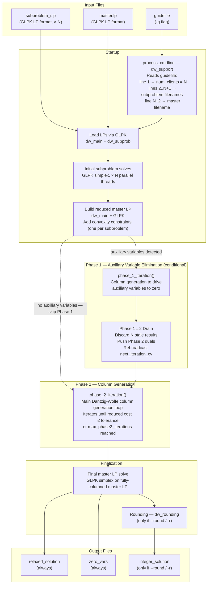

# Input Data Flow Diagram

This diagram shows what input files DWSOLVER requires, how they are consumed, every major
transformation stage (startup, optional Phase 1, Phase 2 column generation, optional rounding),
and what output files are produced.
It is the primary reference for first-time users setting up a problem and for developers
tracing where a particular file is read or written.



> **Solid arrows** = always-executed path.
> **Dashed arrow** = bypass path when no auxiliary variables are detected (Phase 1 skipped entirely).

---

## Guidefile format

The guidefile is a plain-text file, one token per line:

```
line 1:     <N>                ← integer: number of subproblems
line 2:     <subproblem_1.lp>  ← filename of the first subproblem LP
line 3:     <subproblem_2.lp>  ← filename of the second subproblem LP
...
line N+1:   <subproblem_N.lp>  ← filename of the Nth subproblem LP
line N+2:   <master.lp>        ← filename of the master LP
```

**Important**: subproblem filenames come *before* the master filename. Getting this order wrong will cause DWSOLVER to load the wrong LP as the master problem.

**Example** — a two-subproblem problem:
```
2
sub1.lp
sub2.lp
master.lp
```

All filenames are resolved relative to the working directory at the time `dwsolver` is invoked. All LP files must be in [GLPK LP format](https://en.wikibooks.org/wiki/GLPK/LP_Format).

---

## Phase 1: when does it run?

Phase 1 runs only when the initial master LP is infeasible with the starting basis — which occurs when the LP requires auxiliary (artificial) variables to reach a feasible point. DWSOLVER detects this by checking the master LP column structure after construction: if any auxiliary variables (`y_i`) have been introduced to handle constraints that cannot be satisfied by the initial subproblem extreme points alone, `need_phase_one` is set and the Phase 1 loop runs.

If the initial LP is already feasible (no auxiliary variables), DWSOLVER skips Phase 1 entirely and proceeds directly to Phase 2. The bypass dashed arrow in the diagram above shows this path.

---

## Output files

| Output file | Produced | Contents |
|-------------|----------|----------|
| `relaxed_solution` | Always | Continuous optimal variable values from the final master LP solve |
| `zeros_rounded` | Only if `-r` / `--round` passed | Solution with selected zero-valued variables rounded according to the rounding heuristic |
| `integerized_zeros` | Only if `-i` / `--integerize` passed | Integer-adjusted variant of `zeros_rounded`, enforcing integrality on chosen variables |
| `basis_iteration_*` | Only if `--write-bases` passed | Per-iteration LP basis snapshots from the master solve |
| `phase1_step_*.cpxlp`, `master_step_*.cpxlp` | Only if `--write-int-probs` passed | CPLEX LP snapshots of the master problem during Phase 1 (`phase1_step_*.cpxlp`) and Phase 2 (`master_step_*.cpxlp`) |

All output files are written to the working directory.
