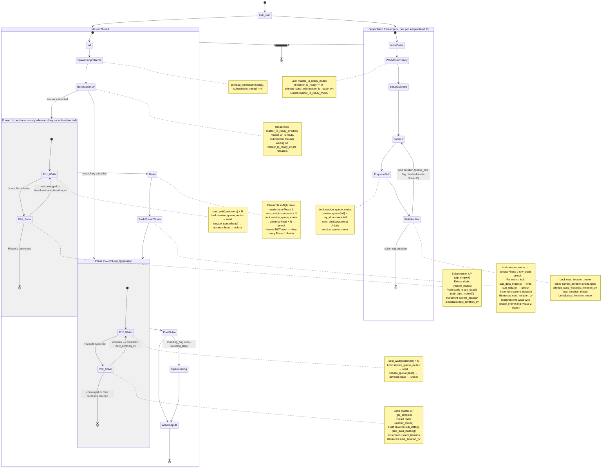

# Threading and Control-Flow Diagram

This diagram shows the complete lifecycle of the master thread and the N subproblem
threads in a single DWSOLVER run — from startup through Phase 1 (if needed), the
Phase 1→2 drain transition, Phase 2 column generation, and final output.
It is the primary reference for anyone modifying concurrency logic: every mutex,
semaphore, and condition variable that gates a state transition is labeled on the
relevant edge or state.

---

## How to read this diagram

Follow one complete DW iteration from the master's perspective, noting each sync primitive in the order it fires:

1. **Master waits for N results** — enters `Ph1_WaitN` or `Ph2_WaitN` and calls `sem_wait(customers)` once per subproblem. The `customers` semaphore is the signal that a subproblem has finished solving and enqueued itself.

2. **Subproblem posts a result** — after `SolveLP` completes, the subproblem enters `EnqueueSelf`: it locks `service_queue_mutex`, appends its own ID to `service_queue[tail]`, advances the tail pointer, calls `sem_post(customers)` (decrementing the master's wait count by one), and unlocks.

3. **Master dequeues and processes** — on each `sem_wait` return, the master locks `service_queue_mutex`, reads `service_queue[head]`, advances the head pointer, and unlocks. This gives it the index of the subproblem that reported. Master pushes a new column to the reduced master LP for that result.

4. **Master solves and pushes duals** — after collecting all N results, master calls `glp_simplex` on the master LP (protected by `master_mutex` for dual reads), then iterates over `sub_data[i]`, writing updated `r` values under `sub_data_mutex[i]`.

5. **Master wakes subproblems** — master increments `current_iteration` and calls `pthread_cond_broadcast(next_iteration_cv)` under `next_iteration_mutex`. All subproblems waiting in `WaitNextIter` unblock, re-lock, check the iteration counter, and return to `SolveLP`.

6. **Repeat** — steps 1–5 repeat until reduced costs satisfy the optimality tolerance or the maximum iteration count is reached.

---

## Phase 1→2 transition

When Phase 1 converges, the last `phase_1_iteration()` call has already broadcast `next_iteration_cv` to release subproblems. Those subproblems wake up, solve with `phase_one=1` and Phase 1 duals, and enqueue their results — but master is no longer in Phase 1's wait loop. It has moved on to clearing auxiliary variables and setting `sub_data[j].phase_one = 0` for all j.

**The race**: if master immediately entered `phase_2_iteration()`, subproblem results still carrying Phase 1 duals and the Phase 1 convexity objective would be read as Phase 2 results. The reduced-cost check would use the Phase 1 convexity-constraint dual (`r_phase1`), which can be ≤ 0 at Phase 1 convergence, causing premature termination at a suboptimal point.

**The drain fix** (introduced in commit `7576722`): master explicitly discards all N in-flight transition results by calling `sem_wait(customers)` × N and dequeuing from `service_queue` without using the results. It then pushes fresh Phase 2 duals from the just-solved master LP into every `sub_data[i]`, increments `current_iteration`, and rebroadcasts `next_iteration_cv`. Subproblems wake with `phase_one=0` and correct Phase 2 duals, and their next iteration is the first genuine Phase 2 solve.

---

## Single-subproblem variant (N=1)

When `num_clients = 1`, the fan-out is trivial: there is exactly one subproblem thread, and the master's `sem_wait(customers)` loop runs only once per iteration. The `service_queue` still exists but always holds at most one entry. All synchronization primitives are still used and the diagram remains accurate; the only behavioral difference is that "N results collected" means "1 result collected".
